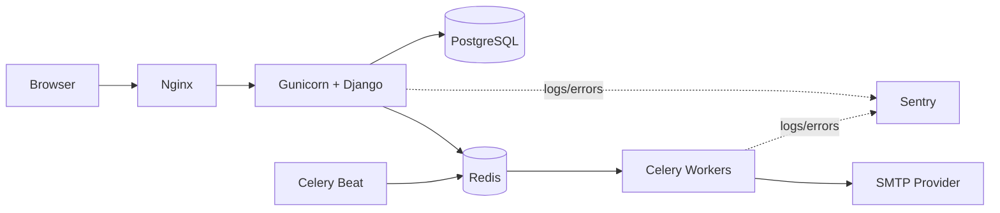

# Matchday Store

[](https://github.com/ViktorShadr/matchday_store/actions/workflows/ci-cd.yml)


🇷🇺 Russian version: [README.ru.md](README.ru.md)

---

## Overview

Matchday Store is a production-oriented Django MVP for a football club merchandise store.

The project models a realistic ecommerce workflow with transactional checkout, stock reservation, asynchronous processing, staff tooling, operational monitoring, and production-style deployment infrastructure.

The main engineering focus is not CRUD functionality, but consistency, reliability, observability, security, and maintainability under real operational conditions.

---

## Highlights

- Transaction-safe checkout with stock reservation
- Idempotent order processing
- Concurrency protection with `select_for_update`
- Async email pipeline with Celery
- Structured JSON logging with request tracing
- Dockerized production deployment
- GitHub Actions CI/CD pipeline
- Background job processing with retries
- Staff dashboard for operational workflows
- 300+ automated tests including concurrency scenarios

---

## Features

### Ecommerce & Checkout

- Product catalog with categories, variants, SKU support, pricing, stock visibility, and product images
- Guest and authenticated carts with session merge on login
- Pickup checkout workflow
- Reservation-based stock handling
- Duplicate-submit protection with idempotent checkout flow
- Manual payment workflow synchronized with order statuses
- Order lifecycle transitions with staff-controlled issue flow
- Automatic release of reserved stock on cancellation or expiration

### Staff & Operations

- Warehouse/staff dashboard
- Order filtering and moderation workflows
- Payment status management
- Internal order notes and transition history
- Role-based staff access with Django permissions

### Infrastructure & Reliability

- Dockerized runtime environment
- Nginx reverse proxy + Gunicorn application server
- Redis + Celery background processing
- Dedicated email worker queue
- Healthchecks and operational scripts
- GitHub Actions CI/CD pipeline
- Automated Docker image publishing to GHCR

### Security & Stability

- Transactional stock consistency
- Race-condition protection
- Rate limiting for critical endpoints
- CSP and secure cookie configuration
- CSRF protection
- Safe redirect validation
- Sensitive-data masking in logs
- Environment-based production settings

### Observability

- Structured JSON logging
- Request tracing with `X-Request-ID`
- Sentry integration
- Audit logging
- Celery request propagation
- Health endpoints
- Ecommerce analytics integration

---

# Architecture

## High-Level Architecture



The project uses a modular Django monolith architecture with explicit separation between:

- HTTP layer
- application workflows
- domain services
- repositories
- query services
- presenters
- infrastructure concerns

The public surface is intentionally server-rendered for simplicity and operational reliability, while critical business workflows are isolated in service-layer logic.

---

## Why a Modular Monolith?

The project intentionally uses a modular monolith instead of microservices because:

- transactional consistency is easier to guarantee,
- infrastructure remains operationally simple,
- local development is significantly faster,
- deployment complexity stays manageable,
- business workflows remain easier to reason about.

Background workloads are isolated through Celery queues rather than separate deployable services.

---

# Engineering Challenges

## Preventing Overselling

One of the main technical challenges was guaranteeing stock consistency during concurrent checkout attempts.

The solution combines:

- `transaction.atomic()`
- `select_for_update()`
- conditional `F()` updates
- deterministic lock ordering
- idempotent checkout tokens
- database constraints
- concurrency tests using `TransactionTestCase`

This ensures that parallel checkout requests cannot oversell inventory.

---

## Reliable Checkout Flow

The checkout system was designed to tolerate:

- page refreshes,
- duplicate form submits,
- network retries,
- parallel browser requests,
- asynchronous email failures.

The final workflow uses scoped idempotency keys and transaction-aware reservation logic to safely return an already-created order instead of creating duplicates.

---

## Background Processing Reliability

Email delivery and scheduled maintenance tasks run asynchronously through Celery.

Special attention was paid to:

- retry safety,
- exponential backoff,
- transient SMTP handling,
- queue isolation,
- failure visibility through logging and Sentry.

---

# Tech Stack

| Area | Technologies |
| --- | --- |
| Backend | Python 3.12, Django 5.2 |
| Database | PostgreSQL 16 |
| Async | Celery 5.x, Redis 7 |
| Infrastructure | Docker, Docker Compose, Nginx, Gunicorn |
| CI/CD | GitHub Actions, GHCR |
| Monitoring | Structured logs, Sentry, healthchecks |
| Security | django-csp, django-ratelimit, CSRF protection |
| Frontend | Django Templates, Bootstrap, Vanilla JS |
| Testing | Django TestCase, TransactionTestCase |

---

# Project Structure

```text
.
├── analytics/
├── config/
├── docker/
├── ops/
├── orders/
├── payments/
├── store/
├── support/
├── users/
├── .github/workflows/
├── docker-compose.yml
├── docker-compose.prod.yml
├── Dockerfile
└── pyproject.toml
```

---

# Key Engineering Decisions

## Service Layer Instead of Fat Views

Business workflows are isolated inside dedicated services:

- `CheckoutService`
- `OrderCancellationService`
- `OrderIssueService`
- `PaymentWorkflowService`
- `DashboardOrderFlowService`

Views remain thin and handle only HTTP concerns.

This keeps critical workflows testable and independent from Django request objects.

---

## Explicit Reservation Model

The system separates:

- physical stock (`quantity`)
- reserved stock (`reserved_quantity`)

This models a realistic pickup-order warehouse flow:

- checkout reserves items,
- cancellation releases reservation,
- order issue consumes physical inventory.

---

## Request-Scoped Logging

Every request receives an `X-Request-ID`.

The same identifier propagates through:

- Django logs,
- Celery tasks,
- Sentry events.

Production logs support JSON formatting with masking of passwords, tokens, cookies, emails, and phone numbers.

---

## Queue Separation

The Compose stack separates workloads into:

- `web`
- `worker`
- `email-worker`
- `beat`

This avoids email delivery slowing down application processing and makes operational troubleshooting simpler.

---

# Checkout & Stock Flow

```text
Cart
   ↓
Checkout Submit
   ↓
Order + Payment
   ↓
Stock Reservation
   ↓
Staff Processing
   ↓
Order Issued
   ↓
Physical Stock Reduced
```

Stock lifecycle:

| Event | quantity | reserved_quantity |
| --- | ---: | ---: |
| Checkout placed | unchanged | increases |
| Order cancelled | unchanged | decreases |
| Order issued | decreases | decreases |

Critical checkout protections include:

- atomic database transactions,
- row locking,
- conditional updates,
- idempotency keys,
- duplicate-submit handling,
- guest active-order limits by email, phone, session, and IP to protect stock reservations,
- transactional cleanup of purchased cart items.

---

# Security

The project includes multiple production-oriented security controls:

- CSRF protection
- Secure cookies
- CSP with nonce-based scripts
- Rate limiting for auth and checkout endpoints
- Safe redirect validation
- Image upload validation
- Environment-driven production settings
- Sensitive-data masking in logs
- Docker non-root runtime
- HSTS-ready configuration
- Nginx request limits
- Anti-overselling database constraints

---

# Observability & Monitoring

Operational visibility was treated as a first-class concern.

Implemented features include:

- request tracing with `X-Request-ID`
- structured JSON logging
- audit logger for business events
- Sentry integration for Django and Celery
- Docker healthchecks
- Celery task metadata logging
- sensitive-data masking
- ecommerce analytics events

Planned improvements:

- Prometheus metrics
- Grafana dashboards
- operational KPI tracking

---

# Background Tasks

Celery uses Redis as both broker and result backend.

Current asynchronous workflows include:

- registration emails
- order notifications
- support notifications
- scheduled order auto-cancellation
- email retries with exponential backoff

Queues are separated between general tasks and email delivery tasks.

---

# Testing

The project currently contains 300+ automated Django tests.

Covered areas include:

- checkout validation
- stock reservation
- cancellation flows
- idempotent checkout
- payment synchronization
- concurrency handling
- dashboard permissions
- email retry logic
- logging and observability
- security validation
- smoke end-to-end flows

Run tests locally:

```bash
poetry run python manage.py test
```

Or inside Docker:

```bash
docker compose exec web python manage.py test
```

---

# CI/CD

GitHub Actions pipeline includes:

- Black
- isort
- flake8
- migration validation
- Django system checks
- PostgreSQL + Redis test environment
- Docker image build
- GHCR publishing
- SSH-based production deployment

Deployment flow:

```text
Push to main
    ↓
GitHub Actions
    ↓
Run tests
    ↓
Build Docker image
    ↓
Push to GHCR
    ↓
Deploy to production server
```

---

# Local Development

## Clone Repository

```bash
git clone https://github.com/ViktorShadr/matchday_store.git
cd matchday_store
```

## Configure Environment

```bash
cp .env.example .env
```

## Start Application

```bash
docker compose up --build -d
```

Application:

```text
http://localhost:8000
```

## Create Superuser

```bash
docker compose exec web python manage.py createsuperuser
```

## Run Tests

```bash
docker compose exec web python manage.py test
```

---

# Deployment

Local deployment:

```bash
docker compose up --build -d
```

Production deployment:

```bash
docker compose -f docker-compose.prod.yml pull
docker compose -f docker-compose.prod.yml up -d
```

---

# Future Improvements

- Online payment providers
- DRF-based public API
- Warehouse/ERP integrations
- Delivery providers
- Object storage + CDN
- Prometheus + Grafana monitoring
- Coverage reporting
- Telegram/SMS notifications
- Sales analytics dashboard

---

# Production-Oriented Approach

This project was built not only as a feature demo, but as an operationally maintainable backend service.

Special attention was paid to:

- consistency under concurrency,
- failure handling,
- retry safety,
- observability,
- deployment automation,
- secure defaults,
- maintainable architecture.

The goal was to build a compact but realistic ecommerce MVP that demonstrates backend engineering practices commonly found in production systems.
