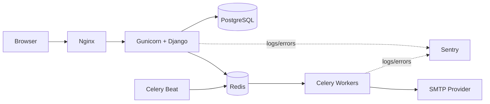

# Matchday Store

[](https://github.com/ViktorShadr/matchday_store/actions/workflows/ci-cd.yml)


🇬🇧 English version: [README.md](README.md)

---

# Обзор проекта

Matchday Store — production-oriented MVP интернет-магазина футбольной атрибутики, построенный на Django.

Проект моделирует реальный ecommerce workflow:
- каталог товаров,
- корзину,
- checkout,
- резервирование остатков,
- обработку заказов,
- асинхронные задачи,
- staff/dashboard workflows,
- production deployment,
- observability и monitoring.

Основной фокус проекта — не CRUD-функциональность, а:
- консистентность данных,
- защита от race conditions,
- надежность checkout flow,
- idempotency,
- observability,
- secure defaults,
- maintainable architecture.

---

# Highlights

- Транзакционный checkout с резервированием товара
- Защита от overselling
- Idempotent order processing
- Concurrency protection через `select_for_update`
- Асинхронная email pipeline на Celery
- Structured JSON logging с request tracing
- Dockerized production deployment
- GitHub Actions CI/CD
- Staff dashboard для операционной работы
- 300+ автоматизированных тестов

---

# Возможности проекта

## Ecommerce & Checkout

- Каталог товаров с категориями, SKU, вариантами и изображениями
- Гостевые и авторизованные корзины
- Merge корзин после авторизации
- Checkout flow для pickup-заказов
- Reservation-based stock handling
- Защита от duplicate submit
- Manual payment workflow
- Order lifecycle transitions
- Автоматическое освобождение резерва при отмене заказа

## Staff & Operations

- Staff dashboard
- Управление заказами
- Warehouse workflow
- Payment status management
- История изменений заказа
- Role-based access

## Infrastructure & Reliability

- Dockerized runtime environment
- Nginx + Gunicorn
- Redis + Celery
- Отдельный email-worker
- Healthchecks
- GitHub Actions CI/CD
- Публикация Docker image в GHCR

## Security & Stability

- Transactional stock consistency
- Защита от race conditions
- Rate limiting
- CSP и secure cookies
- CSRF protection
- Safe redirect validation
- Маскирование sensitive data в логах
- Environment-based production settings

## Observability

- Structured JSON logging
- Request tracing через `X-Request-ID`
- Sentry integration
- Audit logging
- Celery request propagation
- Health endpoints
- Ecommerce analytics integration

---

# Архитектура

## High-Level Architecture



Проект построен как modular Django monolith с разделением на:

- HTTP layer
- application workflows
- domain services
- repositories
- query services
- presenters
- infrastructure layer

Публичная часть intentionally server-rendered для простоты эксплуатации и надежности.

Критические бизнес-процессы изолированы внутри service layer.

---

# Почему Modular Monolith?

Проект сознательно построен как modular monolith, а не microservices architecture.

Причины:
- проще гарантировать transactional consistency,
- ниже operational complexity,
- быстрее локальная разработка,
- проще деплой,
- проще reasoning над бизнес-логикой,
- меньше инфраструктурного overhead для MVP.

Background workloads изолированы через Celery queues, а не через отдельные сервисы.

---

# Engineering Challenges

## Защита от Overselling

Одной из главных технических задач была защита остатков товара при параллельных checkout attempts.

Решение построено на комбинации:
- `transaction.atomic()`
- `select_for_update()`
- conditional `F()` updates
- deterministic lock ordering
- idempotency tokens
- database constraints
- concurrency tests

Это гарантирует, что параллельные запросы не смогут продать один и тот же товар сверх доступного остатка.

---

## Надежный Checkout Flow

Checkout workflow проектировался с учетом:
- refresh страницы,
- duplicate submits,
- network retries,
- параллельных запросов,
- ошибок email delivery.

Для этого используется:
- scoped idempotency keys,
- transactional reservation logic,
- повторная проверка idempotency после получения locks.

---

## Надежность Background Tasks

Email delivery и scheduled jobs выполняются через Celery.

Особое внимание уделено:
- retry safety,
- exponential backoff,
- transient SMTP handling,
- queue isolation,
- observability ошибок через logging и Sentry.

---

# Tech Stack

| Область | Технологии |
| --- | --- |
| Backend | Python 3.12, Django 5.2 |
| Database | PostgreSQL 16 |
| Async | Celery 5.x, Redis 7 |
| Infrastructure | Docker, Docker Compose, Nginx, Gunicorn |
| CI/CD | GitHub Actions, GHCR |
| Monitoring | Structured logs, Sentry, healthchecks |
| Security | django-csp, django-ratelimit, CSRF protection |
| Frontend | Django Templates, Bootstrap, Vanilla JS |
| Testing | Django TestCase, TransactionTestCase |

---

# Структура проекта

```text
.
├── analytics/
├── config/
├── docker/
├── ops/
├── orders/
├── payments/
├── store/
├── support/
├── users/
├── .github/workflows/
├── docker-compose.yml
├── docker-compose.prod.yml
├── Dockerfile
└── pyproject.toml
```

---

# Ключевые инженерные решения

## Service Layer вместо Fat Views

Основная бизнес-логика вынесена в отдельные сервисы:

- `CheckoutService`
- `OrderCancellationService`
- `OrderIssueService`
- `PaymentWorkflowService`
- `DashboardOrderFlowService`

Views обрабатывают только HTTP concerns.

Это делает critical workflows:
- тестируемыми,
- переиспользуемыми,
- независимыми от Django request objects.

---

## Reservation Model

Проект разделяет:
- физический остаток (`quantity`)
- зарезервированный остаток (`reserved_quantity`)

Workflow:
- checkout резервирует товар,
- cancellation освобождает резерв,
- issue уменьшает физический остаток.

Это ближе к реальному warehouse workflow.

---

## Request-Scoped Logging

Каждый запрос получает `X-Request-ID`.

Этот идентификатор прокидывается:
- в Django logs,
- в Celery tasks,
- в Sentry events.

Production logs поддерживают JSON-формат и маскирование sensitive data:
- passwords,
- tokens,
- cookies,
- emails,
- phone numbers.

---

## Queue Separation

Инфраструктура разделяет workload на:
- `web`
- `worker`
- `email-worker`
- `beat`

Это предотвращает ситуацию, когда email delivery блокирует основную обработку запросов.

---

# Checkout & Stock Flow

```text
Cart
   ↓
Checkout Submit
   ↓
Order + Payment
   ↓
Stock Reservation
   ↓
Staff Processing
   ↓
Order Issued
   ↓
Physical Stock Reduced
```

Lifecycle остатков:

| Событие | quantity | reserved_quantity |
| --- | ---: | ---: |
| Checkout | unchanged | increases |
| Cancellation | unchanged | decreases |
| Issue | decreases | decreases |

Ключевые защиты checkout:
- atomic transactions,
- row locking,
- conditional updates,
- idempotency keys,
- duplicate-submit protection,
- transactional cleanup.

---

# Security

Проект включает production-oriented security controls:

- CSRF protection
- Secure cookies
- CSP с nonce-based scripts
- Rate limiting
- Safe redirect validation
- Image upload validation
- Environment-driven settings
- Sensitive-data masking
- Docker non-root runtime
- HSTS-ready configuration
- Nginx request limits
- Anti-overselling constraints

---

# Observability & Monitoring

Observability рассматривался как first-class concern.

Реализовано:
- request tracing
- structured JSON logging
- audit logger
- Sentry integration
- Docker healthchecks
- Celery task logging
- sensitive-data masking
- ecommerce analytics events

Планируется:
- Prometheus metrics
- Grafana dashboards
- KPI monitoring

---

# Background Tasks

Celery использует Redis как broker и result backend.

Асинхронные workflow:
- registration emails
- order notifications
- support notifications
- scheduled auto-cancel
- email retries

Используется queue separation между:
- general tasks
- email tasks

---

# Тестирование

Проект содержит 300+ automated Django tests.

Покрыты:
- checkout validation
- stock reservation
- cancellation workflows
- idempotent checkout
- payment synchronization
- concurrency handling
- dashboard permissions
- email retry logic
- logging & observability
- security validation
- smoke E2E flows

Запуск тестов:

```bash
poetry run python manage.py test
```

Или внутри Docker:

```bash
docker compose exec web python manage.py test
```

---

# CI/CD

GitHub Actions pipeline включает:

- Black
- isort
- flake8
- migration validation
- Django checks
- PostgreSQL + Redis test environment
- Docker image build
- GHCR publishing
- SSH deployment

Deployment flow:

```text
Push to main
    ↓
GitHub Actions
    ↓
Run tests
    ↓
Build Docker image
    ↓
Push to GHCR
    ↓
Deploy to production server
```

---

# Локальный запуск

## Clone Repository

```bash
git clone https://github.com/ViktorShadr/matchday_store.git
cd matchday_store
```

## Configure Environment

```bash
cp .env.example .env
```

## Start Application

```bash
docker compose up --build -d
```

Приложение:

```text
http://localhost:8000
```

## Create Superuser

```bash
docker compose exec web python manage.py createsuperuser
```

## Run Tests

```bash
docker compose exec web python manage.py test
```

---

# Deployment

Local deployment:

```bash
docker compose up --build -d
```

Production deployment:

```bash
docker compose -f docker-compose.prod.yml pull
docker compose -f docker-compose.prod.yml up -d
```

---

# Future Improvements

- Online payments
- DRF/OpenAPI API
- Warehouse/ERP integrations
- Delivery providers
- Object storage + CDN
- Prometheus + Grafana
- Coverage reporting
- Telegram/SMS notifications
- Sales analytics dashboard

---

# Production-Oriented Approach

Проект создавался не как demo CRUD application, а как production-oriented backend MVP.

Особое внимание уделялось:
- consistency under concurrency,
- failure handling,
- retry safety,
- observability,
- deployment automation,
- secure defaults,
- maintainable architecture.

Цель проекта — построить компактный, но реалистичный ecommerce backend с инженерными практиками, характерными для production systems.